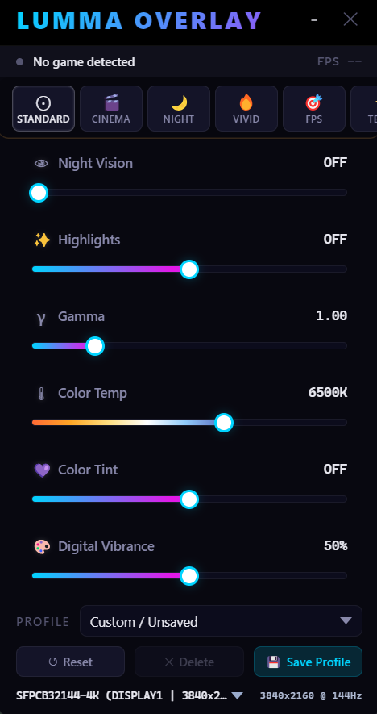

  <strong>Lumma Overlay de controle de monitor dentro de jogos — sem precisar alt-tab.</strong>

  
  
  

  

  <strong>Controle brilho, contraste, gama, temperatura de cor e mais — direto de dentro de qualquer jogo.</strong>

---

## O que é o Lumma Overlay?

O Lumma Overlay é uma sobreposição leve e transparente que fica por cima dos seus jogos e permite ajustar as configurações do monitor em tempo real — **sem nunca sair do jogo**.

Feito para gamers que querem ajustar a tela na hora, seja escurecendo uma cena de terror, aumentando o contraste em jogos competitivos ou ajustando a temperatura de cor para sessões noturnas.

---

## Recursos

| Recurso | Descrição |
|---------|-----------|
| Controle do Monitor em Tempo Real | Ajuste brilho, contraste, gama, temperatura de cor, saturação e mais via DDC/CI |
| Detecção Automática de Jogos | Detecta automaticamente quando você entra/sai de jogos em tela cheia |
| Contador de FPS | FPS em tempo real usando Intel PresentMon via ETW |
| Perfis por Jogo | Salve configurações por jogo e carregue automaticamente |
| Suporte a Controle Xbox | Navegação completa pelo D-Pad — sem teclado |
| Presets Rápidos | Presets de brilho/contraste com um clique para cenários comuns |
| Modo Compacto | Overlay minimal que não atrapalha a jogatina |
| Início com o Windows | Inicia automaticamente junto com o sistema |
| Menu na Bandeja | Controle total pelo ícone na área de notificação |
| Verificador de Atualizações | Verifica automaticamente por novas versões |

---

## Controles pelo Teclado

| Atalho | Ação |
|--------|------|
| `Ctrl + Shift + O` | Mostrar/esconder overlay |
| `Ctrl + Shift + Cima` | Brilho +5% |
| `Ctrl + Shift + Baixo` | Brilho -5% |
| `Ctrl + Shift + Direita` | Contraste +5% |
| `Ctrl + Shift + Esquerda` | Contraste -5% |
| `Ctrl + Shift + R` | Restaurar padrão |
| `Ctrl + Shift + P` | Trocar perfil |

---

## Controle Xbox

| Botão | Ação |
|-------|------|
| **View + Select** (segurar) | Abrir/fechar modo controle |
| **D-Pad Cima** | Mover seleção para cima |
| **D-Pad Baixo** | Mover seleção para baixo |
| **D-Pad Esquerda** | Diminuir valor selecionado |
| **D-Pad Direita** | Aumentar valor selecionado |

> O overlay detecta automaticamente quando você está em um jogo e muda para o modo controle sem interrupção.

---

## Instalação

1. **Baixe** o instalador mais recente na página de [Releases](https://github.com/Bob3111/lumma-overlay/releases/latest)
2. **Execute** `Lumma_Overlay_Setup_1.1.0.exe` como Administrador
3. **Siga** o assistente de instalação
4. **Abra** pelo atalho na Área de Trabalho ou Menu Iniciar

> O app precisa de privilégios de Administrador para se comunicar com monitores via DDC/CI e capturar dados de FPS.

---

## Configurações e Opções

### Opções de Interface
- **Modo Compacto** — Reduz o tamanho do overlay para cobertura mínima na tela
- **Mostrar Presets Rápidos** — Ativa/desativa a barra de presets
- **Mostrar Seção de Perfis** — Ativa/desativa o seletor de perfis
- **Transparência** — Ajuste a opacidade do overlay de 35% a 100%

### Perfis
- Crie perfis personalizados para diferentes jogos ou cenários
- Carregamento automático quando um jogo específico é detectado
- Exporte e compartilhe perfis com outros usuários

### Seleção de Monitor
- Selecione qual monitor controlar (suporte a múltiplos monitores)
- Aplique configurações globalmente ou por monitor

### Início com o Windows
- Ative/desative "Iniciar com o Windows" pelo menu na bandeja ou Configurações > Sobre
- Roda silenciosamente em segundo plano, pronto quando você precisar

---

## Como Funciona

O Lumma Overlay usa duas tecnologias principais:

### Protocolo DDC/CI
O app se comunica com seu monitor usando o protocolo **Display Data Channel / Command Interface** — o mesmo padrão usado pelos softwares dos fabricantes de monitores. Isso permite controle em nível de hardware de brilho, contraste e outras configurações diretamente pelo cabo de vídeo (HDMI/DisplayPort).

### Captura de FPS via PresentMon
Os dados de FPS são capturados usando o **Intel PresentMon**, uma ferramenta open-source que usa Windows Event Tracing (ETW) para medir o tempo entre frames com precisão de sub-milissegundo. Isso te dá leituras de FPS em tempo real e precisas, sem impacto na performance.

---

## Requisitos

| Requisito | Detalhes |
|-----------|----------|
| **SO** | Windows 10 ou Windows 11 |
| **Monitor** | Compatível com DDC/CI (a maioria dos monitores modernos) |
| **Modo do Jogo** | Janela sem borda recomendado para visibilidade do overlay |
| **Permissões** | Administrador (necessário para DDC/CI e monitoramento de FPS) |

> O DDC/CI precisa estar ativado nas configurações OSD do seu monitor. A maioria dos monitores já vem com isso ativado por padrão.

---

## Changelog

### v1.1.0 — Primeiro Lançamento
- Controle completo via DDC/CI (brilho, contraste, gama, temperatura de cor, saturação)
- Detecção automática de jogos com perfis por jogo
- Contador de FPS via PresentMon
- Suporte a controle Xbox (navegação pelo D-Pad)
- Sistema de presets rápidos
- Modo compacto
- Início automático com o Windows
- Controle total pela bandeja do sistema
- Verificador de atualizações
- Sistema de perfis (salvar/carregar/exportar)

---

## Segurança e Privacidade

- **Sem telemetria** — O Lumma Overlay não coleta nem envia nenhum dado
- **Sem internet necessária** — Funciona totalmente offline (verificação de atualizações é opcional)
- **Zero dependências externas** — Tudo está incluso no instalador
- **Compilado e ofuscado** — Todo o código é compilado e ofuscado para segurança

---

  Feito com ❤️ por <strong><a href="https://www.youtube.com/@Doug_tech">@Doug_tech</a></strong>

  <a href="https://github.com/Bob3111/lumma-overlay/releases/latest">Baixar Última Versão</a>

